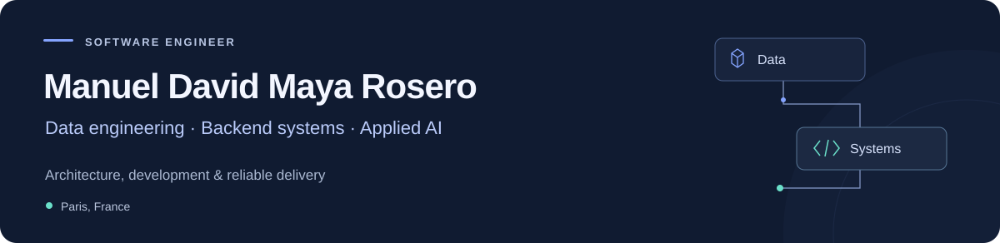

  <picture>
    <source media="(max-width: 600px)" srcset="assets/profile-header-mobile.svg" />
    
  </picture>

  
  &nbsp;
  

 

Software engineer focused on data engineering, backend systems and applied AI. At **MODUO Ingénierie**, I work as an AI Software Architect, taking responsibility for architectural decisions, development and server operations.

I collaborate with engineers and domain experts to turn construction workflows into useful software. My interests include **reliable data pipelines, distributed systems and observability**.

 

## Engineering in practice

<table>
  <tr>
    <td width="50%" valign="top">
      <h3>Platforms &amp; APIs</h3>
      
Developed and extended <strong>ModuoCopil</strong>, a Django/PostgreSQL portal used by 50 employees. Built its authenticated REST API so other applications can reuse project and team data.

      
<code>Django</code> <code>PostgreSQL</code> <code>OpenAPI</code>

    </td>
    <td width="50%" valign="top">
      <h3>Applied AI &amp; retrieval</h3>
      
Built <strong>MODUO Chat</strong> with hybrid document retrieval, source citations and resumable indexing. At Siigo, evaluated an AI assistant against more than 200 reference question-answer pairs.

      
<code>Python</code> <code>RAG</code> <code>Evaluation</code>

    </td>
  </tr>
  <tr>
    <td width="50%" valign="top">
      <h3>Delivery &amp; reliability</h3>
      
Built CI/CD tooling for Docker deployments with automated tests, health checks and rollback. Designed OIDC single sign-on for six internal applications.

      
<code>Docker</code> <code>GitHub Actions</code> <code>OIDC</code>

    </td>
    <td width="50%" valign="top">
      <h3>Technical collaboration</h3>
      
Led four engineering students through planning and technical reviews for a university-policy assistant at <strong>Universidad Nacional de Colombia</strong>.

      
<code>Planning</code> <code>Technical reviews</code> <code>Teamwork</code>

    </td>
  </tr>
</table>

 

## Selected public work

My professional work involves internal company systems. These repositories showcase personal projects and university coursework.

<table>
  <tr>
    <td colspan="2" valign="top">
      <h3><a href="https://manuelma4.github.io/">Personal portfolio ↗</a></h3>
      
Experience, project case studies and technical background, presented in English, French and Spanish.

      
<code>JavaScript</code> <code>HTML</code> <code>CSS</code> &nbsp; <a href="https://github.com/Manuelma4/manuelma4.github.io">Explore the source →</a>

    </td>
  </tr>
  <tr>
    <td width="50%" valign="top">
      <h3><a href="https://github.com/Manuelma4/AlgorithmsUN2022II">Algorithms &amp; complexity →</a></h3>
      
Sorting, recurrence sequences and complexity analysis through individual and group computational experiments.

      
<code>Python</code> <code>Jupyter</code> <code>Coursework</code>

    </td>
    <td width="50%" valign="top">
      <h3><a href="https://github.com/Manuelma4/Wash-Your-Hands">Wash Your Hands →</a></h3>
      
Android coursework with a handwashing timer, instructional screens and Firebase integration.

      
<code>Java</code> <code>Android</code> <code>Firebase</code>

    </td>
  </tr>
</table>

 

## Tools I work with

**Backend** &nbsp; Python · TypeScript/JavaScript · Go · Django · FastAPI · Flask · Node.js

**Data** &nbsp; SQL · PostgreSQL · MongoDB · ETL · Databricks · Azure · AWS S3

**Delivery** &nbsp; Docker · Linux · GitHub Actions · Automated testing · CI/CD

**Applied AI** &nbsp; RAG · Ollama · ChromaDB · Azure OpenAI · Azure AI Search

 

## Education &amp; perspective

Completed studies across Colombia and France, combining software engineering, data science and digital economics.

| Institution | Programme |
| :--- | :--- |
| **Universidad Nacional de Colombia** | Systems and Computer Engineering |
| **Télécom Paris** | Engineering programme · Data Science and MODS |
| **Dauphine–PSL** | M2 IREN double-degree programme |

 

  <strong>Spanish</strong> Native &nbsp; · &nbsp; <strong>English</strong> C1 &nbsp; · &nbsp; <strong>French</strong> C1

  <a href="https://manuelma4.github.io/">Explore my work</a> &nbsp; · &nbsp; <a href="https://www.linkedin.com/in/manueldmaya/">Let's connect</a>

